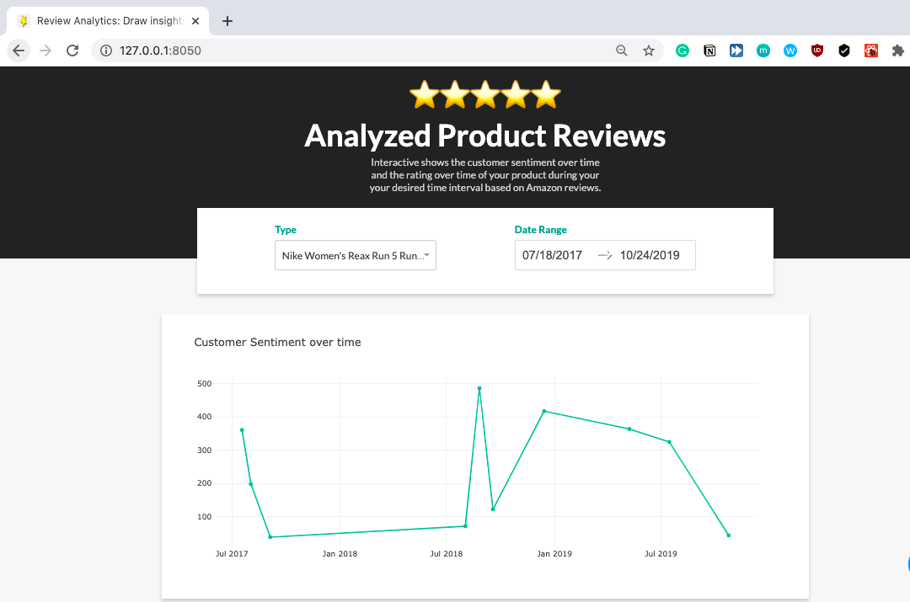
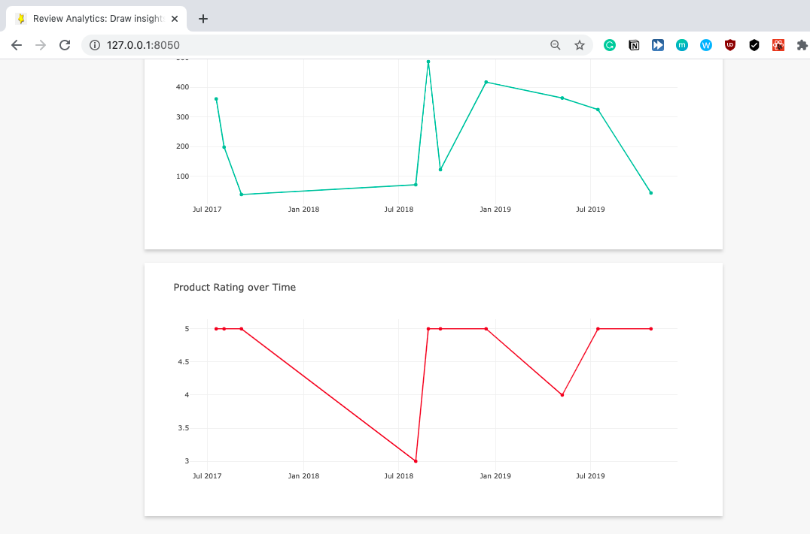

# Product Review Visualizer
Interactively visualizes customer's sentiment for your products based on reviews from Amazon!

## Project logic
- User select the product they want to investigate
- Our scraper would scrape the Amazon review for this product
- We run sentiment analysis on the Amazon review
- Visualizes the result

## Future improvements
- [ ] Fix product dropdown UI
- [ ] Amazon recently changed their web layout so our scraper can only fetch the first 100 of reviews. Fix this.
- [ ] Change "product" to "type" in analyzed.csv
- [ ] Date doesn't reflect on graph after selection
